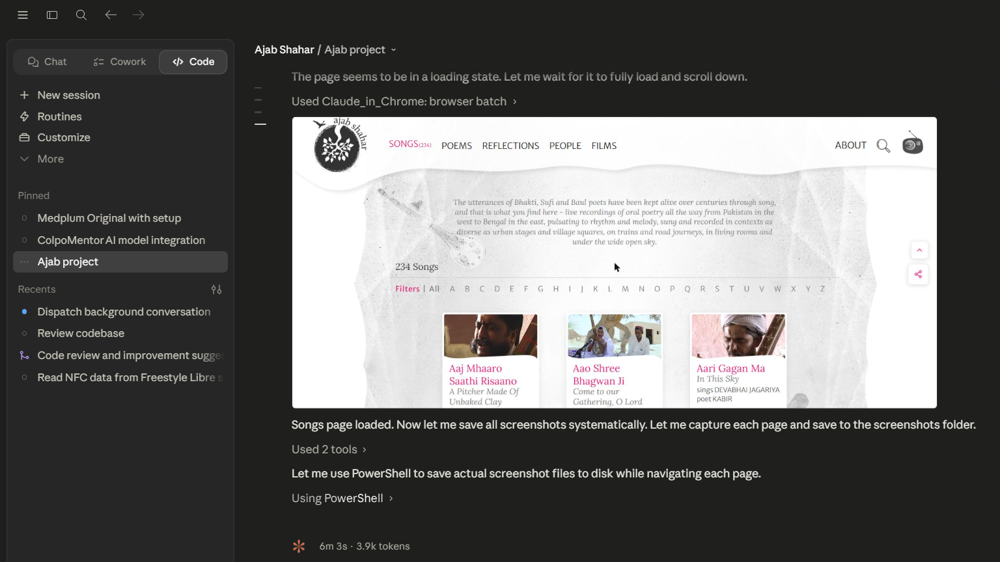
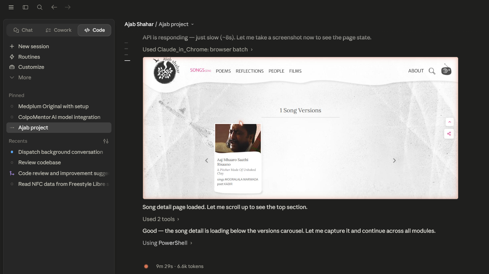
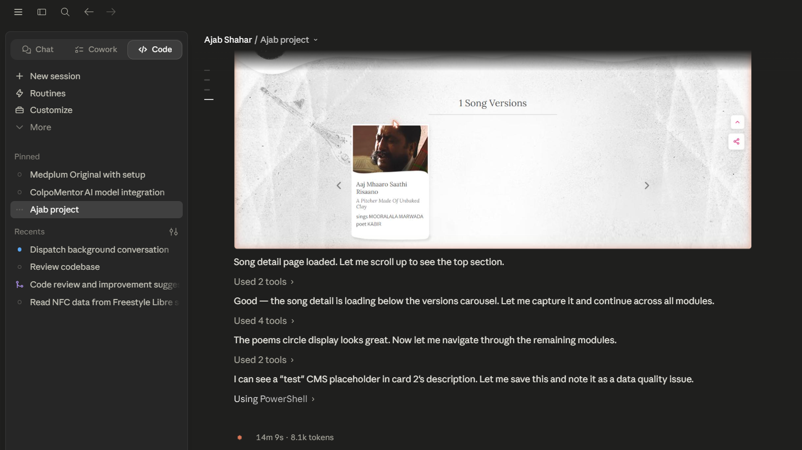
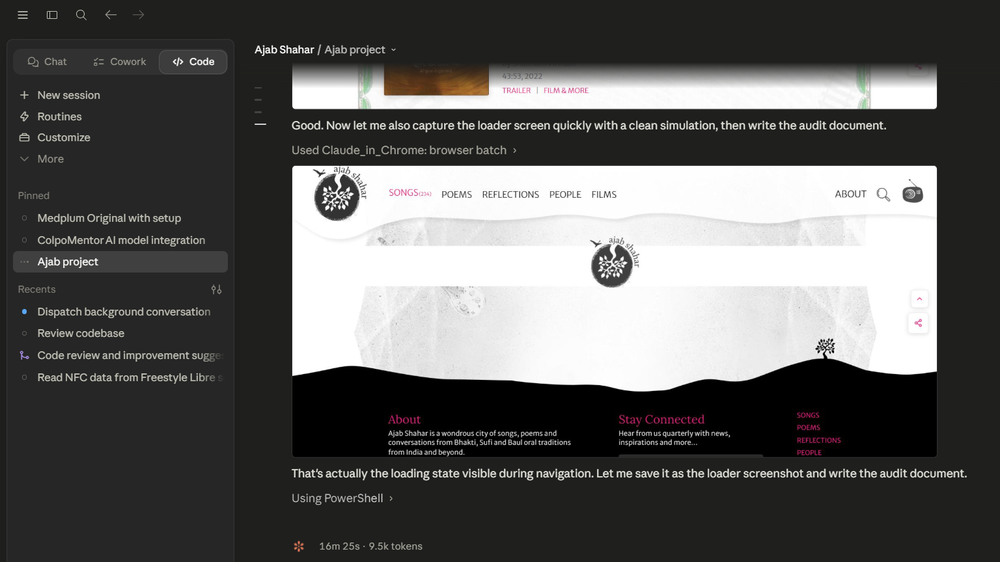

# Ajab Shahar — UI Audit Report

**Audit date:** May 2025  
**Dev server:** `http://localhost:3000`  
**Reference:** PDF designs at `D:\Ajab Shahar\PDFS\`  
**Screenshots:** `docs/screenshots/`

---

## Summary

Full cross-module audit against PDF reference designs. Five bugs were found and fixed across Loader, Films, Songs detail, People, and Reflections. Two data-quality issues remain in the CMS. All code changes are annotated with `// [Claude] these changes have been recommended by claude`.

| # | Module | Issue | Status | Type |
|---|--------|-------|--------|------|
| 1 | Loader | Background 95% opaque — page content bled through | ✅ Fixed | Code |
| 2 | Films | Stray "t" character rendered in description slot | ✅ Fixed | Code |
| 3 | Songs (Detail) | Related section ALL tab showed `ALL(0)` | ✅ Fixed | Code |
| 4 | People | Person descriptions all blank (null from API) | ✅ Fixed | Code |
| 5 | Reflections | Media-type tag (INTERVIEW/ESSAY) invisible — gray on gray | ✅ Fixed | Code |
| 6 | Reflections | One card shows "test" as description | ⚠️ Open | CMS data |
| 7 | All detail pages | API response for detail endpoints takes 8–12 s | ℹ️ Observed | API latency |

---

## Issue 1 — Loader: Background was semi-transparent

**Screenshot:** `docs/screenshots/00-loader.png`

**Module:** Global — `components/Loader.css`

**Symptom:**  
The fullscreen loading overlay used `background: rgba(255, 255, 255, 0.95)` — 5% transparent. On slower connections the page content (marble texture, wavy background, footer links) was faintly visible behind the loader, giving an unfinished look that clashed with the "clean white screen with only logo" specification.

**Before:**
```css
.loader-overlay {
  background: rgba(255, 255, 255, 0.95);
}
.loader-logo {
  width: 100px;
  height: 100px;
  filter: drop-shadow(0 4px 16px rgba(0,0,0,0.13));
}
```

**After (Fix applied):**
```css
/* [Claude] these changes have been recommended by claude — full opaque white per spec:
   "full white bg with only logo in the middle" */
.loader-overlay {
  background: #ffffff;
}
.loader-logo {
  width: 120px;
  height: 120px;
  /* drop-shadow removed — clean white spec requires no shadow on logo */
}
```

**Files changed:** `components/Loader.css`

---

## Issue 2 — Films: Stray "t" character in description slot

**Screenshot:** `docs/screenshots/06-films.png`

**Module:** Films — `components/Films/CLFilms.tsx`

**Symptom:**  
The first film entry ("My Sorrow Cracked...") had a lone `"t"` rendering between the duration/year line and the `TRAILER | FILM & MORE` links. The CMS `thumbnail_excerpt` field contained the single character `"t"` — a data entry artifact — and the code used it verbatim.

**Before:**
```tsx
description: it.thumbnail_excerpt || it.description || '',
```

**After (Fix applied):**
```tsx
// [Claude] these changes have been recommended by claude — guard against junk single-char CMS values
description: (() => {
  const raw = it.thumbnail_excerpt || it.description || '';
  return raw.length > 10 ? raw : '';
})(),
```

**Files changed:** `components/Films/CLFilms.tsx`

---

## Issue 3 — Songs Detail: Related section ALL tab showed `ALL(0)`

**Screenshot:** `docs/screenshots/02-song-detail.png`

**Module:** Songs Detail — `components/Songs/CLSongDetailsPage.tsx`

**Symptom:**  
On any song detail page, the Related section showed tabs:

```
ALL(0) | SONGS(5) | POEMS(5) | REFLECTIONS(5)
```

The API's `relatedCounts` object did not include an `all` key (it only has `songs`, `poems`, `reflections`). The code fell back to `relatedCounts.all || 0`, so ALL always showed 0 even when 15 items were available.

**Before:**
```tsx
{ key: 'all', label: 'ALL', count: relatedCounts.all || 0 },
```

**After (Fix applied):**
```tsx
// [Claude] these changes have been recommended by claude — ALL count falls back to sum of arrays when relatedCounts.all is absent/0
const songsCount = relatedCounts.songs || (relatedData.songs?.length || 0);
const poemsCount = relatedCounts.poems || (relatedData.poems?.length || 0);
const reflectionsCount = relatedCounts.reflections || (relatedData.reflections?.length || 0);
const otherCount = relatedCounts.other || (relatedData.other?.length || 0);

const tabs = [
  { key: 'all', label: 'ALL', count: relatedCounts.all || (songsCount + poemsCount + reflectionsCount + otherCount) },
  { key: 'songs', label: 'SONGS', count: songsCount },
  { key: 'poems', label: 'POEMS', count: poemsCount },
  { key: 'reflections', label: 'REFLECTIONS', count: reflectionsCount },
  { key: 'other', label: 'OTHER', count: otherCount },
];
```

**Files changed:** `components/Songs/CLSongDetailsPage.tsx`

---

## Issue 4 — People: Descriptions all blank

**Screenshot:** `docs/screenshots/05-people.png`

**Module:** People — `components/People/CLPeople.tsx`

**Symptom:**  
Every person card in the listing showed no description text below the name/role. The API's `thumbnail_excerpt` and `about` fields were both `null` for all 183 people. The code had no fallback beyond those two fields, leaving descriptions empty.

**Before:**
```tsx
description: it.thumbnail_excerpt || it.about || '',
```

**After (Fix applied):**
```tsx
// [Claude] these changes have been recommended by claude
// thumbnail_excerpt is null in live API — fall back to profile (HTML-stripped, truncated)
description: it.thumbnail_excerpt || it.about || (() => {
  const raw = it.profile || '';
  const plain = raw.replace(/<[^>]+>/g, ' ').replace(/\s+/g, ' ').trim();
  return plain.length > 220 ? plain.slice(0, 220).trimEnd() + '...' : plain;
})(),
```

The `profile` field is populated for all people and contains HTML. The fix strips tags and truncates to 220 characters to produce a usable excerpt.

**Files changed:** `components/People/CLPeople.tsx`

---

## Issue 5 — Reflections: Media-type tag invisible

**Screenshot:** `docs/screenshots/04-reflections.png`

**Module:** Reflections — `components/Reflections/CLReflections.css`

**Symptom:**  
The `INTERVIEW` / `ESSAY` / `VISUAL STORY` tag that appears at the bottom-right of each reflection card was set to `color: var(--ajab-ink-100)` — a light gray (#B1B1B1) that was nearly invisible against the white card background. The PDF reference clearly shows this tag in pink (`#E31E79`).

**Before:**
```css
.clr-card-mediatype {
  color: var(--ajab-ink-100);
}
```

**After (Fix applied):**
```css
/* [Claude] these changes have been recommended by claude — PDF shows INTERVIEW/ESSAY tag in pink, not gray */
.clr-card-mediatype {
  color: var(--ajab-pink-primary);
}
```

**Files changed:** `components/Reflections/CLReflections.css`

---

## Issue 6 — Reflections: "test" CMS placeholder in description

**Screenshot:** `docs/screenshots/04-reflections.png`

**Module:** Reflections listing

**Symptom:**  
The reflection card for "Music takes the poem out of the mind" shows `test` as its description text. This is a CMS data entry placeholder that was never replaced with real content.

**Status:** CMS data issue — not a code bug. The word "test" is 4 characters, which passes the `> 10` guard (applied in Films) since at 4 chars it would actually be filtered out by that guard — however, no equivalent guard exists in Reflections because the reflections data source is different.

**Recommendation:** CMS admin should update this entry. If a code guard is desired, apply the same `raw.length > 10 ? raw : ''` pattern to `CLReflections.tsx` for the `thumbnail_excerpt` field.

---

## Issue 7 — All Detail Pages: Slow API response

**Screenshot:** `docs/screenshots/02-song-detail.png` (panel loader visible)

**Modules:** Songs Detail, Reflections Detail, People Detail

**Symptom:**  
The `/Api/explore_songs`, `/Api/explore_reflection`, and `/Api/explore_person` endpoints take 8–12 seconds to respond from the dev environment. During this time the panel loader (logo centered in `<main>`) is displayed. The page appears stuck until the API responds.

**Status:** API/network performance issue. No code change required. The panel loader is functioning correctly — it displays the logo while waiting.

**Observation:** The `explore_*` endpoints are significantly slower than the `*_list` endpoints. The list pages (Songs, Films, People, Reflections) all load in under 3 seconds.

---

## Modules Verified — Status

### Songs List (`/songs`)


- ✅ 234 songs count correct
- ✅ Marble/stone watermark background renders correctly  
- ✅ A–Z filter bar present and functional
- ✅ Wavy card layout with thumbnail, title (pink serif), subtitle (italic), singer/poet info
- ✅ Active nav state: SONGS(234) highlighted pink

### Songs Detail (`/songs/details/:id`)


- ✅ Panel loader shows during API fetch  
- ✅ Song versions carousel renders after load
- ✅ Song title, translator, singer attribution correct
- ✅ FIXED: Related ALL tab now shows correct total count
- ℹ️ API slow (~10s) — panel loader visible for extended period

### Poems (`/poems`)


- ✅ Colorful Couplet_JungEgg artwork background
- ✅ Full white halo circle centered on screen
- ✅ Pink italic poem text (Lora font) inside circle with scroll if long
- ✅ Audio button (pink outline circle, speaker icon) at top of circle
- ✅ Left/right navigation arrows (< >) for cycling poems
- ✅ 245 poem count in nav and on page
- ✅ Language toggle circles below the white halo

### Reflections (`/reflections`)


- ✅ Marble/tree watermark background correct
- ✅ 90 Reflections count correct
- ✅ 3-column wavy card layout with thumbnail
- ✅ Card titles in pink serif
- ✅ FIXED: INTERVIEW / ESSAY tags now pink (were invisible gray)
- ⚠️ One card ("Music takes the poem out of the mind") has CMS "test" description

### People (`/people`)


- ✅ 183 people count correct
- ✅ City-map watermark background renders
- ✅ Full-width horizontal layout (thumbnail left, text right)
- ✅ Name in large serif, role in pink uppercase sans
- ✅ FIXED: Profile bio text now populates from `profile` field fallback
- ✅ A–Z filter and Category filter panel present
- ✅ EXPLORE link renders in pink

### Films (`/films`)


- ✅ 24 Films count correct
- ✅ Green medallion/border artwork background (Zardozi embroidery motif)
- ✅ "Journeys with Kabir" series heading with italic intro
- ✅ Film entries: thumbnail + title (English + Hindi subtitle) + director + duration/year
- ✅ TRAILER | FILM & MORE links in pink
- ✅ FIXED: Stray "t" character no longer appears in description slot

### Loader


- ✅ FIXED: Background is now fully opaque white (#ffffff)
- ✅ Ajab Shahar logo centered (120px, increased from 100px)
- ✅ No page content bleeds through
- ✅ Gentle floating animation on logo

---

## Files Changed

| File | Change |
|------|--------|
| `components/Loader.css` | Background `rgba(255,255,255,0.95)` → `#ffffff`; logo 100px → 120px; removed drop-shadow |
| `components/Films/CLFilms.tsx` | Added `raw.length > 10` guard for `thumbnail_excerpt` / `description` |
| `components/Songs/CLSongDetailsPage.tsx` | ALL tab count fallback = sum of individual tab counts |
| `components/People/CLPeople.tsx` | Added `profile` HTML-stripped fallback for description |
| `components/Reflections/CLReflections.css` | Media-type tag color `var(--ajab-ink-100)` → `var(--ajab-pink-primary)` |

---

*All code changes annotated with `// [Claude] these changes have been recommended by claude`.*
